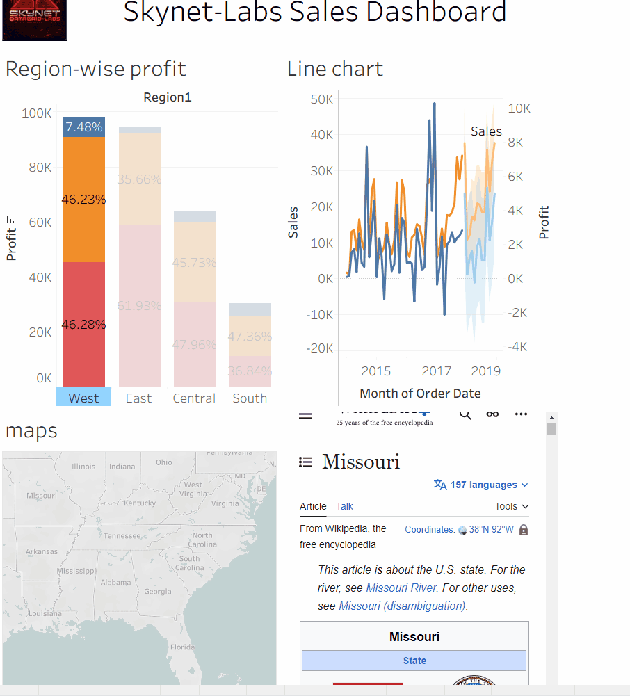

---

# **`Sales Analytics Dashboard`**

**Power BI • Tableau • DAX • Fiscal Years 2019–2024**

A production-grade business intelligence asset synthesizing six years of raw transactional data into executive-level strategic intelligence. Delivers real-time KPI monitoring, regional profitability analysis, and annual growth tracking with sub-quarterly granularity.

---

## Interactive Demonstrations

| Platform | Asset Description |
|----------|--------------------|
| Power BI |  |
| Tableau |  |

*Demonstrates real-time filter application, hierarchical drill-down navigation, and responsive KPI behavior.*

> **Live Deployment:** [Publish to Power BI Service](#) *(insert active URL)*

---

## Strategic Objective

Raw CSV exports do not constitute decision-grade intelligence. This dashboard consolidates fragmented transactional records into a unified analytical layer, enabling stakeholders to traverse from enterprise revenue synthesis to state-level category performance without context switching.

---

## Functional Capabilities

| Feature | Technical Function |
|---------|--------------------|
| **Year-over-Year Growth Analysis** | Revenue trend modeling with quarterly disaggregation and conditional formatting |
| **Profit Margin Heatmap** | Geospatial profitability visualization at state-level granularity |
| **Product Category Ranker** | Automated parametric ranking identifying top and bottom three performers |
| **Dynamic Date Slicer** | Custom temporal range filtering (2019–2024 inclusive) |
| **Export-Ready Tables** | One-click presentation-grade data snapshots (CSV/PDF) |

---

## Technical Architecture

| Layer | Implementation |
|-------|----------------|
| **Visualization Engine** | Power BI Desktop |
| **ETL & Data Cleansing** | Power Query (M language) |
| **Analytical Calculations** | DAX (Revenue, YoY%, Average Order Value, Profit Margin) |
| **Schema Design** | Star Schema (central fact table + dimensional hierarchy) |

---

## Data Source Specification

| Attribute | Detail |
|-----------|--------|
| **Source Type** | Simulated US sales transactions |
| **Temporal Coverage** | Fiscal years 2019–2024 |
| **Record Volume** | Approximately 250,000 rows |
| **Core Fields** | Order date, product category, region, profit, quantity, customer segment |
| **Ingress Format** | CSV / Excel |

---

## Executive Insights Summary

| Finding | Value |
|---------|-------|
| **Top three revenue-generating states** | California, Texas, Florida |
| **Lowest profit margin category** | Office Supplies (8.2%) |
| **Fastest-growing fiscal quarter** | Q4 2023 (+22% YoY, holiday-driven spike) |
| **Actionable strategic recommendation** | Increase Northeast regional marketing expenditure during March to counter pre-spring seasonal demand trough |

---

## Resolved Engineering Challenges

| Challenge | Implemented Solution |
|-----------|----------------------|
| Inconsistent date formatting across six years of disparate CSV imports | Power Query M-language transformation for uniform date parsing prior to load |
| Degraded DAX measure performance on high-volume datasets (~250K rows) | Migrated static dimensional attributes (year, month) to calculated columns; preserved dynamic measures for variable aggregation only |

---

## Deployment Instructions

| Step | Action |
|------|--------|
| **1** | Download `USsalesAnalysis2019-2024Version2.pbix` from repository |
| **2** | Launch Power BI Desktop (free tier capable) |
| **3** | Connect target CSV or mount included sample dataset |
| **4** | Execute exploratory analysis using slicers, drill-through functions, and tooltip layers |

---

