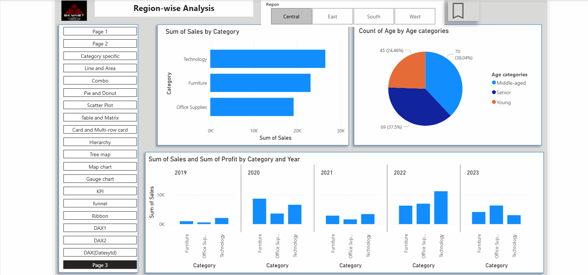
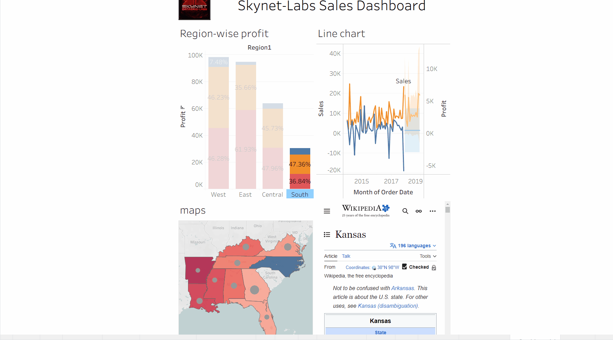

# **`US Sales Analytics Dashboard (2019–2024)`**

**Turn 6 years of raw sales data into strategic business decisions** – an interactive Power BI dashboard with real-time KPIs, regional insights, and year-over-year growth tracking.

---

## **`Live Demo- Using PowerBI`**

## **`Live Demo- Using Tableau`**

*Watch the dashboard in action – filters, drill-downs, and real-time KPIs*

> **Prefer a live interactive version?** [Click here to publish to Power BI Service](#) *(add your published link)*

---

## Why I built this

Raw CSV files don't tell stories. I built this dashboard to give business stakeholders a **single source of truth** – from high-level revenue trends down to which state sold the most electronics in Q3.

---

## Key Features

| Feature | What it does |
|---------|----------------|
| **YoY Growth Analysis** | See revenue change year-over-year with drill-down by quarter |
| **Profit Margin Heatmap** | Visualize profitability across US states |
| **Product Category Ranker** | Auto-highlights top & bottom 3 categories |
| **Dynamic Date Slicer** | Filter any range – 2019 to 2024 |
| **Export-Ready Tables** | Snapshots for presentations |

---

## Tech Stack

- **Power BI Desktop** – Visualization & dashboarding
- **Power Query (M)** – Data cleaning & transformation
- **DAX** – Custom measures (Revenue, YoY%, Average Order Value)
- **Star Schema Modeling** – Central fact table + dimension tables

---

## Dataset

- **Source:** Simulated US sales transactions (2019–2024)
- **Rows:** ~250K+
- **Fields:** Order date, product category, region, profit, quantity, customer segment
- **Format:** CSV / Excel

---

## Key Insights Delivered

- **Top 3 states by revenue:** California, Texas, Florida
- **Lowest profit margin category:** Office Supplies (8.2%)
- **Fastest-growing quarter:** Q4 2023 (holiday spike +22% YoY)
- **Actionable recommendation:** Increase marketing spend in Northeast region during March (pre-spring slump)

---

## What I learned / Challenges I solved

- **Challenge:** Inconsistent date formats across 6 years of CSVs.
  **Solution:** Used Power Query to uniformly parse dates before loading.
- **Challenge:** DAX measure was recalculating slowly on large datasets.
  **Solution:** Switched to calculated columns for static attributes (e.g., year, month).

---

## How to use this repo

1. **Download** `Sales_Dashboard.pbix` (Power BI file)
2. **Open** in Power BI Desktop (free)
3. **Connect** to your own CSV or use the sample data
4. **Explore** slicers, drill-through, and tooltips

> *No Power BI?* Check the `screenshots/` folder for static exports.
